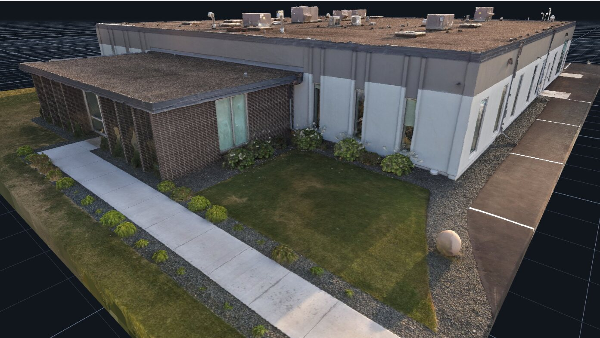
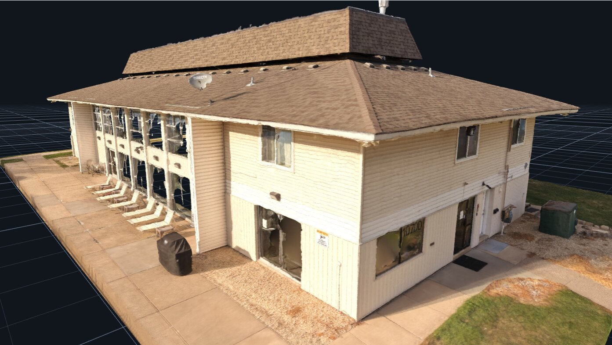

# Drone Building Scans

Two commercial buildings in the Minneapolis suburbs, flown August 2026. Full image sets with
GPS intact, solved camera poses, and the finished 3D models.

Free drone photogrammetry test data for buildings barely exists — published datasets are
either a whole city block or a turntable object, with nothing in between.

CC BY 4.0.

## ⬇ Download

### **[→ huggingface.co/datasets/Matt1up/drone-building-scans](https://huggingface.co/datasets/Matt1up/drone-building-scans)**

Browse the **Files** tab and take what you want — no account needed. The 16 GB of imagery lives
there because GitHub won't host files that size; this repo holds docs, checksums and poses.

[Textured model, 22 MB](https://huggingface.co/datasets/Matt1up/drone-building-scans/resolve/main/flat-roof/model/flat-roof.glb)
 · [sample image](https://huggingface.co/datasets/Matt1up/drone-building-scans/resolve/main/flat-roof/images/DJI_20260822183442_0005_D.JPG)
 · [command-line options](#download)

---


## Building one — single storey commercial



Single storey. Brick and painted panel walls, glazed frontage, sidewalk, landscaping and
striped parking. 951 images, all 951 align.

## Building two — two storey commercial



Two storeys. Lap siding, exterior walkway with railings, external stairs, satellite dish.
395 images, 384 align.

## What's in it

| | `flat-roof` | `shingle-roof` |
|---|---|---|
| images | 951 | 395 |
| size | 12.13 GB | 4.52 GB |
| aligned | **951 / 951** | 384 / 395 |
| camera poses | included | included |
| tie points | 2,230,994 | 1,025,000 |
| reference model | `.glb` + `.obj` | `.glb` |
| scale | **metric — AprilTag control points** | unscaled |

## Capture

Both flown low and slow, under 16 m, gimbal sweeping from straight down to slightly upward.
Nadir frames cover the top, oblique catch the edges, low and level frames get the walls. That
is why the walls resolve — most aerial capture is nadir-only and building sides come out as
smeared vertical texture.

| | |
|---|---|
| **Camera** | DJI FC9313, 8.7 mm, f/1.8 |
| **Resolution** | 4096 × 3072 — native sensor readout, not an interpolated mode |
| **ISO** | 100 throughout |
| **Geotagging** | GPS on every frame — 951/951 and 395/395 |
| **Filenames** | original as written by the aircraft, EXIF untouched |

Native resolution matters. These drones offer a higher-megapixel mode that interpolates from
the same sensor well — it invents texture, and a photogrammetry solver treats invented texture
as real observations. Everything here is the native readout.

## Scale

**The flat-roof scan is metrically scaled from a physical reference.** A calibrated bar
carrying two AprilTag 36h11 markers was laid in the grass and used as control points.

| | |
|---|---|
| bar length | **1.997 m**, centre of tag to centre of tag |
| tag family | AprilTag 36h11 |
| control points | `poses/flat-roof/controlpoints.txt` |

The tags are visible in the imagery, so the scale is checkable from the data rather than
something you take on trust — detect both tags, measure centre to centre, and it should come
out at 1.997 m.

**Watch the tag IDs.** RealityScan labels 36h11 tags on its own scheme, not the official one.
`controlpoints.txt` records them as `36h11:001` and `36h11:002` — those are RealityScan's
labels. Under the official 36h11 numbering that most detectors (OpenCV, the apriltag library)
report, the same two tags come back as **476** and **283**. If you detect the tags yourself and
get numbers that look nothing like the control point file, this is why.

**The shingle-roof scan is not scaled.** No control points, no physical reference in frame.
Geometry is correct; absolute size is not established.

## Camera poses

Both ship solved poses, so you can skip structure-from-motion:

```
<scan>/poses/xmp/        per-image XMP sidecars
<scan>/poses/colmap/     cameras.txt, images.txt, points3D.txt
<scan>/sfm/tiepoints.ply sparse cloud
```

## Gaussian splatting

Poses and tie points are what 3DGS and NeRF pipelines ingest, so both scans train without
running COLMAP first. Small enough that ordinary 3DGS handles them — no need for the
large-scale variants a city block requires. Downsample to ~1600 px before training.

The reference `.glb` gives you something to compare a splat or a mesh against.

## Reproducing

Both scans ship solved poses, so you only need to re-align if you want to compare. See
[docs/reproduce.md](https://github.com/Matt1Up/drone-building-scans-dataset/blob/main/docs/reproduce.md) for settings and what to expect — notably that the
shingle-roof alignment splits into three components and only the largest is published.

## Download

**→ [huggingface.co/datasets/Matt1up/drone-building-scans](https://huggingface.co/datasets/Matt1up/drone-building-scans)**

Click the **Files** tab and download whatever you want in a browser — no tooling, no account.
The images and models live there; the
[GitHub repo](https://github.com/Matt1Up/drone-building-scans-dataset) holds the documentation,
manifests, checksums and camera poses.

**One file, straight from a browser or the shell:**

```bash
curl -LO https://huggingface.co/datasets/Matt1up/drone-building-scans/resolve/main/flat-roof/model/flat-roof.glb
```

**Everything, one command.** Run it again if it stops — finished files are skipped.

```bash
pip install -U huggingface_hub
hf download Matt1up/drone-building-scans --repo-type dataset --local-dir ./drone-building-scans
```

Add `--include 'shingle-roof/*'` or `--include 'flat-roof/*'` to take one building.

**Everything, as a git repo** (needs git-lfs):

```bash
git clone https://huggingface.co/datasets/Matt1up/drone-building-scans
```

**Or the helper scripts** from the [GitHub repo](https://github.com/Matt1Up/drone-building-scans-dataset),
which wrap the same command and add `verify.sh` to check every image against the published
SHA-256 lists:

```bash
git clone https://github.com/Matt1Up/drone-building-scans-dataset && cd drone-building-scans-dataset

./scripts/download.sh --scan shingle-roof   # 4.52 GB, start here
./scripts/download.sh --scan flat-roof      # 12.13 GB
./scripts/download.sh --models              # just the reference models, ~500 MB
./scripts/verify.sh
```

More detail in **[docs/download.md](https://github.com/Matt1Up/drone-building-scans-dataset/blob/main/docs/download.md)**.

## Notes

- Both are commercial buildings. No residential property, no occupants.
- The licence covers the imagery. Trademarks or signage visible in it belong to their owners.
- Shot in evening light — long shadows across the parking areas in both sets.
- 11 of 395 images do not align on the shingle-roof scan. The flat-roof scan solves 951 of 951.

## Licence

[](https://creativecommons.org/licenses/by/4.0/)

[Creative Commons Attribution 4.0](LICENSE). Commercial use and ML training are fine. Credit required.

```
Drone Building Scans — Matthew Guertin, 2026. CC BY 4.0.
https://github.com/Matt1Up/drone-building-scans-dataset
```

## Related

- **[Tree photogrammetry dataset](https://github.com/Matt1Up/tree-photogrammetry-dataset)** — 812 images of one tree, with COLMAP poses.
- **[Chicago / Grant Park](https://github.com/Matt1Up/chicago-photogrammetry-dataset)** — 2,751 aerial images and 241 laser scan files over downtown Chicago.
- **[mattguertin.com](https://mattguertin.com)**
